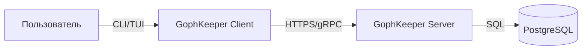

# 1. Уровень 1: Контекст



```
@startuml
!include https://raw.githubusercontent.com/plantuml-stdlib/C4-PlantUML/master/C4_Component.puml

Container(server, "Серверное API")

Component(apiGateway, "API Gateway", "Go", "Обработка REST/gRPC запросов")
Component(authService, "Сервис аутентификации", "Go", "JWT, сессии")
Component(secretService, "Сервис управления секретами", "Go", "CRUD операций с секретами")
Component(backupService, "Сервис резервного копирования", "Go", "Создание и восстановление бэкапов")
Component(dbManager, "Менеджер базы данных", "Go", "Доступ к PostgreSQL")

Rel(apiGateway, authService, "Проверка аутентификации")
Rel(apiGateway, secretService, "Управление секретами")
Rel(apiGateway, backupService, "Вызов бэкапов")
Rel(secretService, dbManager, "Чтение/запись данных")
Rel(backupService, dbManager, "Чтение данных для бэкапа")
Rel(backupService, storage, "Сохраняет бэкапы в S3/MinIO")
@enduml
```